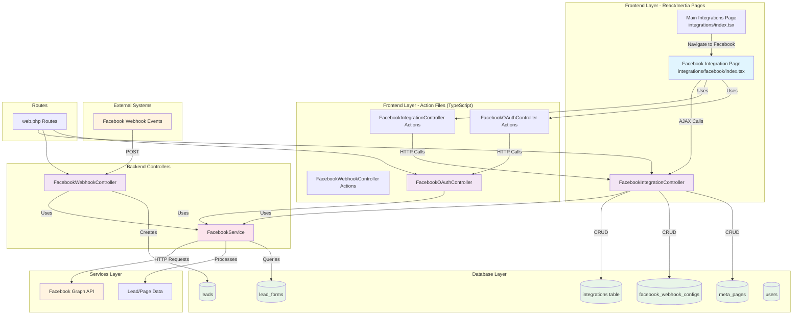

# Facebook Integration System Architecture

## Overview
This document outlines the complete system architecture for the Facebook Integration implementation in the SALF CRM v2 application.

## System Diagram



## Component Details

### 1. Frontend Layer

#### Main Integrations Page (`resources/js/pages/integrations/index.tsx`)
- **Purpose**: Central hub for all integrations management
- **Features**:
  - List all available integrations (Facebook, WhatsApp, Calendar, etc.)
  - Filter integrations by status (active/inactive/all)
  - Quick status overview and navigation to specific integrations
  - Integration status toggles and controls

#### Facebook Integration Page (`resources/js/pages/integrations/facebook/index.tsx`)
- **Purpose**: Main UI for Facebook integration configuration
- **Features**:
  - **Setup Tab**: API Configuration (App ID, App Secret, Page ID)
  - **Permissions Tab**: OAuth authorization and required permissions
  - **Pages Tab**: Facebook page selection and management
  - **Webhooks Tab**: Webhook URL configuration and subscription settings
  - **Lead Generation Tab**: Lead form syncing and notification settings
  - Feature toggles (Messaging, Posts, Insights, Lead Generation)

**Key State Management**:
```typescript
- config: Facebook API credentials and settings
- webhookUrl: Retrieved from database via API call
- pages: Facebook pages associated with the user
- webhookSettings: Subscription configurations
- isLoading: Loading states for various operations
- showToken: Toggle for sensitive data visibility
```

**Form Data Handling by Tab**:

##### Tab 1: Setup Tab
**Purpose**: Configure Facebook API credentials and feature settings  
**Data Source**: `config` state object  
**Form Fields**:
```typescript
// API Configuration Fields
{
  appId: string,           // Facebook App ID (Input field)
  appSecret: string,       // Facebook App Secret (Password input)
  pageId: string,          // Facebook Page ID (Input field)
}

// Feature Toggle Fields  
{
  enableMessaging: boolean,  // Facebook Messenger integration (Switch)
  enablePosts: boolean,      // Post creation/scheduling (Switch)
  enableInsights: boolean,   // Analytics and performance (Switch)
  enableLeadGen: boolean     // Lead form integration (Switch)
}
```
**Event Handlers**:
- `handleChange(e)`: Updates text input fields in config state
- `handleToggleChange(name, value)`: Updates boolean feature flags
- `handleSave()`: Submits config to `/integrations/facebook` (POST)

**API Endpoint**: `POST /integrations/facebook`

##### Tab 2: Permissions Tab  
**Purpose**: Display required permissions and initiate OAuth flow  
**Data Source**: Static permission lists  
**Form Fields**: None (display only)  
**Actions**:
- `requestPermission()`: Initiates OAuth via `/integrations/facebook/oauth/authorize` (POST)

**API Endpoint**: `POST /integrations/facebook/oauth/authorize`

##### Tab 3: Pages Tab
**Purpose**: Select and manage Facebook pages  
**Data Source**: `pages` state array, `selectedPageId`, `pageAccessToken`  
**Form Fields**:
```typescript
// Page Selection
{
  selectedPageId: string,    // Selected page ID (Checkbox selection)
  pageAccessToken: string    // Page access token (Read-only display)
}

// Page Data Structure
{
  id: string,
  name: string,
  page_id: string,
  access_token: string
}
```
**Event Handlers**:
- `fetchPages()`: Retrieves pages from `/integrations/facebook/pages` (GET)
- `handlePageSelect(pageId)`: Updates selected page and token
- `handleSavePages()`: Saves pages to `/meta-pages` (POST)

**API Endpoints**: 
- `GET /integrations/facebook/pages` 
- `POST /meta-pages`

##### Tab 4: Webhooks Tab
**Purpose**: Configure webhook URL and subscription settings  
**Data Source**: `webhookUrl`, `config.webhook_verify_token`, `webhookSettings`  
**Form Fields**:
```typescript
// Webhook Configuration
{
  webhookUrl: string,              // Read-only, fetched from database
  webhook_verify_token: string,    // Verify token (Password input with toggle)
}

// Subscription Settings
{
  subscriptions: {
    messages: boolean,             // Message events (Switch)
    feed: boolean,                 // Feed events (Switch)  
    reactions: boolean,            // Reaction events (Switch)
    comments: boolean,             // Comment events (Switch)
    messaging_postbacks: boolean,  // Postback events (Switch)
    message_deliveries: boolean,   // Delivery events (Switch)
    leadgen: boolean              // Lead generation events (Switch)
  }
}
```
**Event Handlers**:
- `handleWebhookToggle(field, value)`: Updates webhook subscription settings
- `saveWebhookSettings()`: Saves webhook config to `/integrations/facebook/webhooks` (POST)

**API Endpoint**: `POST /integrations/facebook/webhooks`

##### Tab 5: Lead Generation Tab
**Purpose**: Configure lead form syncing and notifications  
**Data Source**: Local state (switches not connected to main config)  
**Form Fields**:
```typescript
// Auto-sync Settings (Note: Currently static, not saved to backend)
{
  autoSyncForms: boolean,      // Auto-sync lead forms (Switch)
  autoSyncLeads: boolean       // Auto-sync leads (Switch)
}

// Notification Settings (Note: Currently static, not saved to backend)
{
  emailNotifications: boolean,  // Email notifications (Switch)
  appNotifications: boolean     // In-app notifications (Switch) 
}
```
**Event Handlers**:
- `syncLeadForms()`: Manual sync via `/integrations/facebook/sync-lead-forms` (POST)
- `syncLeads()`: Manual sync via `/integrations/facebook/sync-leads` (POST)
- Notification save handler: Currently shows toast only (not implemented)

**API Endpoints**: 
- `POST /integrations/facebook/sync-lead-forms`
- `POST /integrations/facebook/sync-leads`

#### Action Files (TypeScript/Wayfinder Integration)
- **FacebookIntegrationController Actions** (`resources/js/actions/.../FacebookIntegrationController.ts`):
  - Auto-generated from Laravel routes
  - Type-safe API calls to backend
  - Methods: index, store, test, insights, posts, webhooks, etc.
  
- **FacebookOAuthController Actions** (`resources/js/actions/.../FacebookOAuthController.ts`):
  - OAuth authorization flow actions
  - Type-safe integration with Laravel backend

- **FacebookWebhookController Actions** (`resources/js/actions/.../FacebookWebhookController.ts`):
  - Webhook management actions
  - Integration testing utilities

### 2. Backend Controllers

#### FacebookIntegrationController
- **Purpose**: Main controller for Facebook integration management
- **Key Methods**:
  - `index()`: Load integration config and webhook URL from database
  - `store()`: Save/update Facebook integration settings
  - `getWebhookConfig()`: Retrieve webhook configuration
  - `subscribeWebhook()`: Subscribe to Facebook webhook events
  - `getPages()`: Fetch user's Facebook pages
  - `syncPageData()`: Sync posts, comments, messages

#### FacebookWebhookController
- **Purpose**: Handle incoming Facebook webhook events
- **Key Methods**:
  - `verify()`: Handle Facebook webhook verification (GET)
  - `handle()`: Process webhook events (POST)
  - `verifySignature()`: Validate webhook authenticity

#### FacebookOAuthController
- **Purpose**: Handle Facebook OAuth authorization flow
- **Key Methods**:
  - `authorize()`: Initiate OAuth flow
  - Handle OAuth callbacks

### 3. Service Layer

#### FacebookService
- **Purpose**: Core service for Facebook API interactions
- **Key Functionalities**:
  - Credential verification
  - API connection testing
  - Page data retrieval
  - Lead form management
  - Webhook subscription management
  - Data synchronization with Facebook Graph API

### 4. Database Models

#### Integration Model
```php
Fields: id, provider, name, config (JSON), active, timestamps
Purpose: Store Facebook integration configuration
Config Structure:
- app_id, app_secret, page_id, access_token
- webhook_url, webhook_verify_token
- features: messaging, posts, insights, comments
- page_info: cached page details
```

#### FacebookWebhookConfig Model
```php
Fields: id, app_id, page_id, subscriptions (JSON), active, timestamps
Purpose: Store webhook subscription settings
Subscriptions: messages, feed, leadgen, etc.
```

#### MetaPage Model
```php
Fields: id, user_id, page_id, access_token, name, last_updated
Purpose: Store Facebook page details and tokens
Relationships: belongsTo User, hasMany LeadForm
```

#### LeadForm Model
```php
Fields: id, page_id, external_id, name, fields (JSON), timestamps
Purpose: Store Facebook lead form definitions
```

### 5. Routes Architecture

#### Public Routes (No Authentication)
```php
GET  /facebook/webhook  -> FacebookWebhookController@verify
POST /facebook/webhook  -> FacebookWebhookController@handle
```

#### Protected Routes (Authentication Required)
```php
integrations/facebook/
├── GET    /                    -> index (load config page)
├── POST   /                    -> store (save config)
├── GET    /webhook-config      -> getWebhookConfig
├── POST   /webhooks            -> subscribeWebhook
├── POST   /test-connection     -> testConnection
├── GET    /insights           -> getPageInsights
├── GET    /posts              -> getPagePosts
├── POST   /posts              -> createPost
├── GET    /page-info          -> getPageInfo
├── POST   /sync               -> syncPageData
├── POST   /deactivate         -> deactivate
├── DELETE /                   -> destroy
├── POST   /oauth/authorize    -> FacebookOAuthController@authorize
├── POST   /pages             -> getPages
├── POST   /forms             -> getForms
└── POST   /form/leads        -> getPageLeads
```

## Data Flow Patterns

### 1. Configuration Setup Flow (Setup Tab)
```
User Input -> handleChange/handleToggleChange -> config state -> handleSave() 
-> POST /integrations/facebook -> FacebookIntegrationController@store 
-> FacebookService@verifyCredentials -> Facebook Graph API -> Database (Integration Model)
```

### 2. OAuth Authorization Flow (Permissions Tab)
```
User Click -> requestPermission() -> POST /integrations/facebook/oauth/authorize 
-> FacebookOAuthController@authorize -> Facebook OAuth -> Redirect -> Access Token Storage
```

### 3. Page Management Flow (Pages Tab)
```
User Action -> fetchPages() -> GET /integrations/facebook/pages 
-> FacebookIntegrationController@getPages -> MetaPage Model
User Selection -> handlePageSelect() -> selectedPageId state -> handleSavePages() 
-> POST /meta-pages -> Database (MetaPage Model)
```

### 4. Webhook Configuration Flow (Webhooks Tab)
```
Page Load -> fetchWebhookConfig() -> GET /integrations/facebook/webhook-config 
-> getWebhookUrlFromDatabase() -> Integration Model -> webhookUrl state
User Config -> handleWebhookToggle() -> webhookSettings state -> saveWebhookSettings() 
-> POST /integrations/facebook/webhooks -> FacebookIntegrationController@subscribeWebhook 
-> Facebook Graph API + Database (FacebookWebhookConfig Model)
```

### 5. Lead Generation Flow (Lead Gen Tab)
```
Manual Sync -> syncLeadForms()/syncLeads() 
-> POST /integrations/facebook/sync-lead-forms or /sync-leads 
-> FacebookService -> Facebook Graph API -> Database (Lead Model)
Webhook Event -> Facebook -> FacebookWebhookController@handle -> Lead Processing
```

### 6. Form Validation & Error Handling Flow
```
Form Submission -> try/catch -> Axios POST -> Backend Validation 
-> Success: toast.success() | Error: toast.error() with validation details
```

## Security Considerations

### 1. Webhook Verification
- Signature verification using app secret
- Token-based verification for webhook setup
- CSRF protection on authenticated routes

### 2. Data Encryption
- App secrets encrypted in database
- Access tokens encrypted in database
- Sensitive data masked in API responses

### 3. Authentication
- All integration management routes protected by authentication
- Webhook endpoints publicly accessible (by design)
- OAuth flow with proper state validation

## Error Handling & Logging

### 1. Logging Strategy
- All Facebook API interactions logged
- Webhook events logged with full payload
- Error conditions logged with context
- Service method exceptions caught and logged

### 2. Fallback Mechanisms
- Webhook URL falls back to route-based URL if not in database
- Configuration loading handles missing data gracefully
- API failures return structured error responses

## Configuration Management

### 1. Environment Variables
- Facebook App credentials
- Webhook verification tokens
- API version settings

### 2. Database Configuration
- Integration-specific settings stored in JSON
- Webhook subscriptions stored as arrays
- Feature flags for different integration capabilities

## Integration Points

### 1. Facebook Graph API
- Version: v23.0 (configurable)
- Endpoints: Pages, Lead Forms, Webhooks, Insights
- Authentication: Page Access Tokens

### 2. Laravel Wayfinder Integration
- Auto-generated TypeScript action files from Laravel routes
- Type-safe API calls between frontend and backend
- Automatic route definition synchronization
- Query parameter handling and validation

### 3. Internal Systems
- Lead Management System
- User Management
- Social Media Content Management
- Analytics and Reporting

### 4. Inertia.js Integration
- Server-side rendering with React components
- Seamless navigation between pages
- Shared data between server and client
- CSRF protection and authentication handling

## Scalability Considerations

### 1. Caching Strategy
- Facebook API responses cached where appropriate
- Configuration data cached
- Page information cached

### 2. Queue Integration
- Background jobs for data synchronization
- Webhook event processing can be queued
- Large data imports handled asynchronously

## Monitoring & Maintenance

### 1. Health Checks
- Connection testing endpoints
- Credential verification
- Webhook subscription status

### 2. Data Synchronization
- Manual sync capabilities
- Automated sync schedules
- Conflict resolution strategies

---

*Last Updated: 2025-08-29*
*System Version: SALF CRM v2 with Laravel 12*